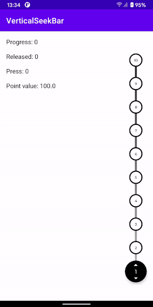

# VerticalSeekBar - library for selecting some range



# Setup
## 1) App level ```build.gradle```
```
dependencies {
    implementation 'implementation com.github.Bodiart:VerticalSeekBar:1.0.0'
}
```

# Usage

Just add to your layout

```
<com.ideil.vertical_seekbar.view.VerticalSeekBar
        android:id="@+id/verticalSeekBar"
        android:layout_width="wrap_content"
        android:layout_height="match_parent" />
```

To set points call
```
verticalSeekBar.setPoints(pointList)
```

To listen point selecting specify callbacks
```
verticalSeekBar.onProgressChangeListener
verticalSeekBar.onReleaseListener
verticalSeekBar.onPressListener
```

Also you can customize colors and texts size
```
verticalSeekBar.setupConfig(config)
```
Where:
 - ```config``` - ```VSBConfig``` object with colors and dimens
